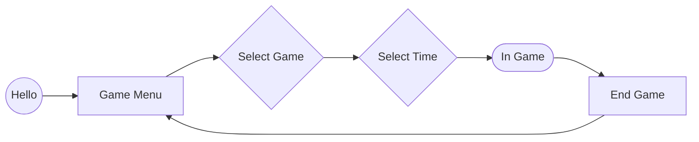

# AIRSOFT BOX

### Game mode
|Function|Type | Desc |
|---|---| --- |
|A| Last Domination | The last team to dominate wins.
|B| Domination Points | Every time you dominate and every X time, the team earns points. In the end, whoever has the most points wins.|
|C| Secure | Must hold the device button for X time to win.
|D| Bomb | Press the button to arm the bomb. And then to disarm. (password can be optional).

### Standard flow

